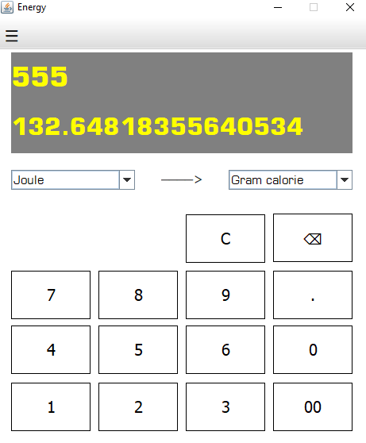

# Calculator in java swing

### Hello there ,

I've created many type of Calculator and converter in java swing.

# Features 

* Normal Calculator
* Standard Calculator
* Scintific Calculator
* Length Converter
* Temperature Converter
* Energy Converter
* Area Converter
* Speed Converter
* Pressure Converter
* Angle Converter
* Frequency Converter
* Volume Converter
* Mass Converter

# Youtube Demo

# Screenshots

# Created by

[Ajaysinh Rathod](https://github.com/Ajaysinh1290)

Email : ajaysinhrathod1290@gmail.com

# Social Media Accounts
&nbsp; &nbsp; &nbsp; &nbsp; &nbsp;
&nbsp; &nbsp; &nbsp; &nbsp; &nbsp; 
&nbsp; &nbsp; &nbsp; &nbsp; &nbsp; 

